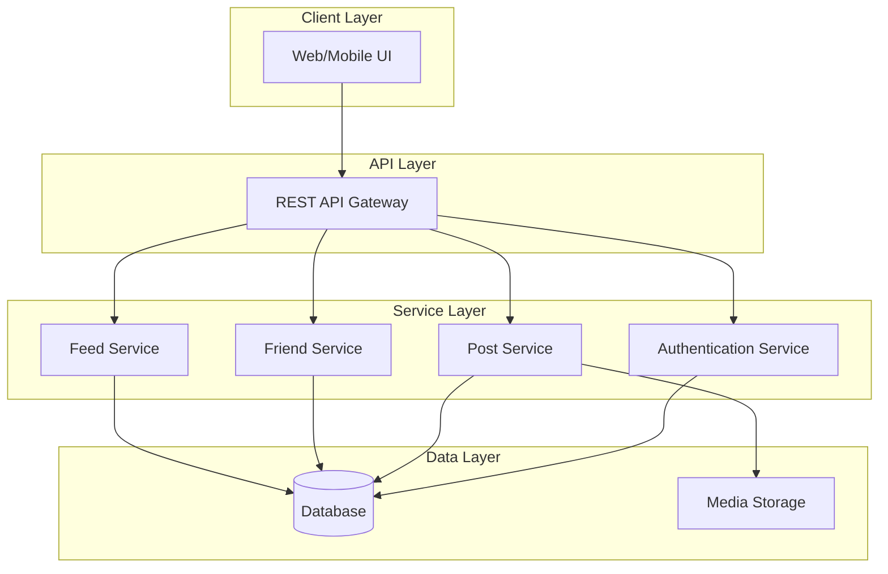
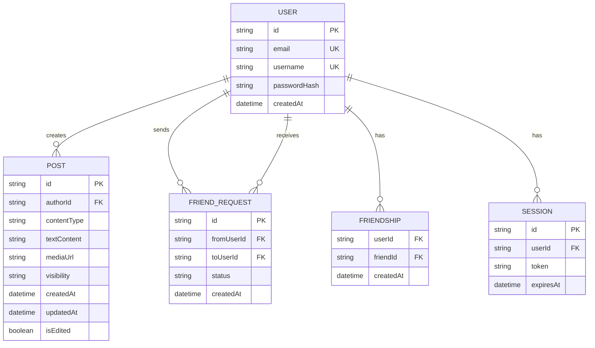

# Design Document: AI Stories Sharing

## Overview

AI Stories Sharing is a social platform for sharing humorous AI-related content. The system follows a layered architecture with clear separation between authentication, content management, and data persistence layers. Users can create posts in multiple formats (text, image, video) with configurable visibility settings.

## Architecture



The architecture consists of:
- **Client Layer**: Web/mobile interfaces for user interaction
- **API Layer**: REST API gateway handling request routing and validation
- **Service Layer**: Business logic components for authentication, posts, friends, and feed
- **Data Layer**: Database for structured data and object storage for media files

## Components and Interfaces

### Authentication Service

```typescript
interface AuthenticationService {
  register(email: string, username: string, password: string): Promise<User>;
  login(email: string, password: string): Promise<Session>;
  logout(sessionId: string): Promise<void>;
  validateSession(sessionId: string): Promise<User | null>;
}

interface User {
  id: string;
  email: string;
  username: string;
  passwordHash: string;
  createdAt: Date;
}

interface Session {
  id: string;
  userId: string;
  token: string;
  expiresAt: Date;
}
```

### Post Service

```typescript
interface PostService {
  createPost(userId: string, content: PostContent, visibility: Visibility): Promise<Post>;
  getPost(postId: string, requesterId: string | null): Promise<Post | null>;
  updatePost(postId: string, userId: string, updates: PostUpdate): Promise<Post>;
  deletePost(postId: string, userId: string): Promise<void>;
  validateContent(content: PostContent): ValidationResult;
}

type ContentType = 'text' | 'image' | 'video';
type Visibility = 'friends_only' | 'public';

interface PostContent {
  type: ContentType;
  text?: string;
  mediaUrl?: string;
  mediaFile?: File;
}

interface Post {
  id: string;
  authorId: string;
  content: PostContent;
  visibility: Visibility;
  createdAt: Date;
  updatedAt: Date;
  isEdited: boolean;
}

interface PostUpdate {
  content?: PostContent;
  visibility?: Visibility;
}

interface ValidationResult {
  valid: boolean;
  errors: string[];
}
```

### Friend Service

```typescript
interface FriendService {
  sendFriendRequest(fromUserId: string, toUserId: string): Promise<FriendRequest>;
  acceptFriendRequest(requestId: string, userId: string): Promise<void>;
  declineFriendRequest(requestId: string, userId: string): Promise<void>;
  removeFriend(userId: string, friendId: string): Promise<void>;
  getFriends(userId: string): Promise<User[]>;
  areFriends(userId1: string, userId2: string): Promise<boolean>;
}

interface FriendRequest {
  id: string;
  fromUserId: string;
  toUserId: string;
  status: 'pending' | 'accepted' | 'declined';
  createdAt: Date;
}
```

### Feed Service

```typescript
interface FeedService {
  getFeed(userId: string | null, pagination: Pagination): Promise<FeedResult>;
  canViewPost(post: Post, viewerId: string | null, friendsList: string[]): boolean;
}

interface Pagination {
  limit: number;
  offset: number;
}

interface FeedResult {
  posts: Post[];
  hasMore: boolean;
  total: number;
}
```

## Data Models

### Database Schema



### Media Storage

Media files are stored with the following structure:
- Path format: `/{userId}/{postId}/{filename}`
- Supported image formats: JPEG, PNG, GIF
- Supported video formats: MP4, WebM
- Maximum image size: 10MB
- Maximum video size: 100MB

### JSON Serialization Format

Posts are serialized to JSON for storage and API responses:

```json
{
  "id": "post_123",
  "authorId": "user_456",
  "content": {
    "type": "text",
    "text": "My AI assistant thought I wanted to order 100 pizzas..."
  },
  "visibility": "public",
  "createdAt": "2024-01-15T10:30:00Z",
  "updatedAt": "2024-01-15T10:30:00Z",
  "isEdited": false
}
```


## Correctness Properties

*A property is a characteristic or behavior that should hold true across all valid executions of a system—essentially, a formal statement about what the system should do. Properties serve as the bridge between human-readable specifications and machine-verifiable correctness guarantees.*

### Property 1: Registration creates valid user
*For any* valid registration details (email, username, password), registering should create a user that can be retrieved with matching email and username.
**Validates: Requirements 1.1**

### Property 2: Unique email and username enforcement
*For any* existing user, attempting to register with the same email OR the same username should be rejected.
**Validates: Requirements 1.2, 1.3**

### Property 3: Valid credentials login success
*For any* registered user, logging in with the correct email and password should create a valid session.
**Validates: Requirements 1.4**

### Property 4: Invalid credentials rejection
*For any* login attempt with credentials that don't match a registered user, the login should be rejected.
**Validates: Requirements 1.5**

### Property 5: Logout terminates session
*For any* authenticated user session, logging out should invalidate the session such that subsequent requests with that session are rejected.
**Validates: Requirements 1.6**

### Property 6: Password hashing
*For any* registered user, the stored password should not equal the plaintext password provided during registration.
**Validates: Requirements 1.7**

### Property 7: Unauthenticated post creation denied
*For any* post creation request without valid authentication, the request should be denied.
**Validates: Requirements 2.1**

### Property 8: Valid content creates post
*For any* authenticated user and valid content (non-empty text, valid image format, or valid video format), creating a post should succeed and the post should be retrievable.
**Validates: Requirements 2.2, 2.3, 2.4**

### Property 9: Visibility required with default
*For any* post creation without explicit visibility, the post should be created with friends_only visibility.
**Validates: Requirements 3.1, 3.6**

### Property 10: Friends-only visibility enforcement
*For any* post with friends_only visibility, the post should be visible to users in the author's friends list and invisible to users not in the author's friends list.
**Validates: Requirements 3.2, 3.4, 3.5, 4.3**

### Property 11: Public visibility
*For any* post with public visibility, the post should be visible to all users including unauthenticated users.
**Validates: Requirements 3.3, 4.2, 4.5**

### Property 12: Feed ordering
*For any* feed request, the returned posts should be ordered by creation date in descending order (newest first).
**Validates: Requirements 4.4**

### Property 13: Friend request creation
*For any* authenticated user sending a friend request to a different user, a pending friend request should be created.
**Validates: Requirements 5.1**

### Property 14: Bidirectional friendship
*For any* accepted friend request, both users should appear in each other's friends list. For any friend removal, both users should be removed from each other's friends list.
**Validates: Requirements 5.3, 5.5**

### Property 15: Declined request no friendship
*For any* declined friend request, neither user should appear in the other's friends list.
**Validates: Requirements 5.4**

### Property 16: Edit marks as edited and preserves createdAt
*For any* post edit, the isEdited flag should be true and the createdAt timestamp should equal the original creation timestamp.
**Validates: Requirements 6.1, 6.6**

### Property 17: Authorization for own posts only
*For any* user attempting to edit or delete another user's post, the operation should be denied.
**Validates: Requirements 6.2, 6.4**

### Property 18: Delete removes post
*For any* post deleted by its author, the post should no longer be retrievable.
**Validates: Requirements 6.3**

### Property 19: Visibility change on edit
*For any* post edit that includes a visibility change, the post's visibility should be updated to the new value.
**Validates: Requirements 6.5**

### Property 20: Post serialization round-trip
*For any* valid post object, serializing to JSON and deserializing back should produce an equivalent post object.
**Validates: Requirements 7.1, 7.4, 7.5**

### Property 21: User persistence
*For any* created user account, the user data should be retrievable from the database.
**Validates: Requirements 7.2**

### Property 22: Media persistence
*For any* uploaded media file, the file should be retrievable from storage.
**Validates: Requirements 7.3**

## Error Handling

### Authentication Errors
| Error | Condition | Response |
|-------|-----------|----------|
| `DUPLICATE_EMAIL` | Email already registered | 409 Conflict |
| `DUPLICATE_USERNAME` | Username already taken | 409 Conflict |
| `INVALID_CREDENTIALS` | Wrong email/password | 401 Unauthorized |
| `SESSION_EXPIRED` | Session token expired | 401 Unauthorized |
| `INVALID_SESSION` | Session token invalid | 401 Unauthorized |

### Post Errors
| Error | Condition | Response |
|-------|-----------|----------|
| `UNAUTHORIZED` | Not logged in | 401 Unauthorized |
| `FORBIDDEN` | Not post owner | 403 Forbidden |
| `EMPTY_CONTENT` | No content provided | 400 Bad Request |
| `INVALID_FORMAT` | Unsupported file format | 400 Bad Request |
| `FILE_TOO_LARGE` | File exceeds size limit | 413 Payload Too Large |
| `POST_NOT_FOUND` | Post doesn't exist | 404 Not Found |
| `ACCESS_DENIED` | No visibility access | 403 Forbidden |

### Friend Errors
| Error | Condition | Response |
|-------|-----------|----------|
| `SELF_FRIEND_REQUEST` | Request to self | 400 Bad Request |
| `DUPLICATE_REQUEST` | Request already exists | 409 Conflict |
| `REQUEST_NOT_FOUND` | Friend request doesn't exist | 404 Not Found |
| `NOT_FRIENDS` | Users are not friends | 400 Bad Request |

## Testing Strategy

### Unit Tests
Unit tests focus on specific examples, edge cases, and error conditions:

- **Authentication**: Test specific registration scenarios, login edge cases, session expiration
- **Content Validation**: Test boundary conditions for file sizes, specific format acceptance/rejection
- **Visibility**: Test specific friend/non-friend access scenarios
- **Error Handling**: Test each error condition returns correct response

### Property-Based Tests
Property tests verify universal properties across randomly generated inputs. Use a property-based testing library (e.g., fast-check for TypeScript, Hypothesis for Python).

**Configuration**:
- Minimum 100 iterations per property test
- Each test must reference its design document property
- Tag format: **Feature: ai-stories-sharing, Property {number}: {property_text}**

**Property Test Coverage**:
- Properties 1-6: Authentication service properties
- Properties 7-11: Post creation and visibility properties
- Property 12: Feed ordering property
- Properties 13-15: Friend management properties
- Properties 16-19: Post management properties
- Properties 20-22: Persistence and serialization properties

### Integration Tests
- End-to-end flows for user registration → login → post creation → feed viewing
- Friend request flow: send → accept → visibility verification
- Media upload and retrieval flow

### Test Data Generation
For property-based tests, generate:
- Random valid emails, usernames, passwords
- Random text content (non-empty strings)
- Random valid image/video files within size limits
- Random user pairs for friend operations
- Random post collections for feed testing
